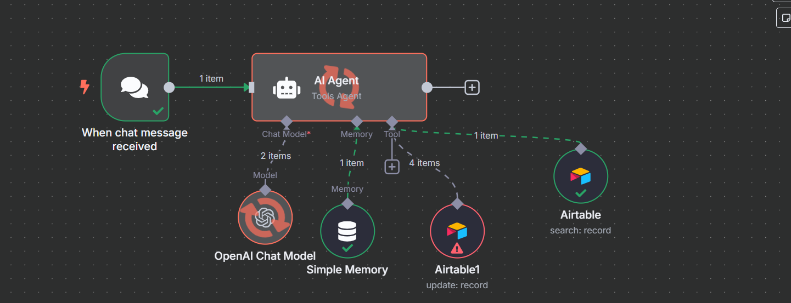

# 🛒 Inventory Chat Agent with n8n + OpenAI + Airtable

This project is a smart AI agent built using [n8n](https://n8n.io/), [OpenAI](https://openai.com/), and [Airtable](https://airtable.com/).  
It allows users to **interact via chat** and **perform real-time inventory tasks** such as **searching** and **updating** items from Airtable.

> 💬 Ask the agent for stock info, updates, or data queries — all handled via natural language.

---

## 🧠 Features

- 🧑‍💻 Chat-based interface with AI agent trigger
- 🧠 Memory to retain short-term conversation context
- 🔎 Search inventory items from Airtable
- ✏️ Update inventory data in Airtable
- 🤖 Powered by GPT-4o-mini (OpenAI)

---

## 🔄 Workflow Overview

### ✨ Flow Breakdown

1. **🟢 When Chat Message Received**
   - Trigger node that activates the AI Agent when a user sends a message via chat (via webhook)

2. **🤖 AI Agent**
   - Receives the chat input
   - Uses:
     - OpenAI for understanding and replying
     - Memory for context
     - Airtable tools for live operations

3. **💬 OpenAI Chat Model**
   - GPT-4o-mini processes the input and generates context-aware responses

4. **🧠 Simple Memory**
   - Stores conversation history to maintain state across multiple messages

5. **🔎 Airtable Tool #1 (Search)**
   - Allows the agent to retrieve inventory information based on product name, stock level, etc.

6. **✍️ Airtable Tool #2 (Update)**
   - Lets the agent update inventory items, such as adjusting stock counts or product details

---

## 📂 Project Structure

